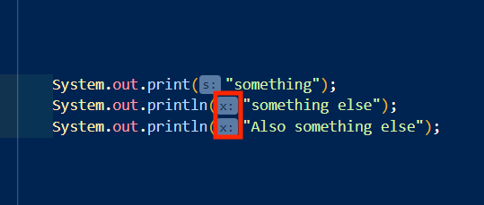
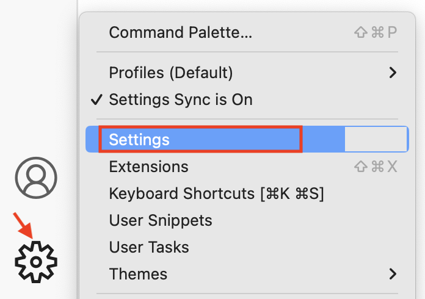
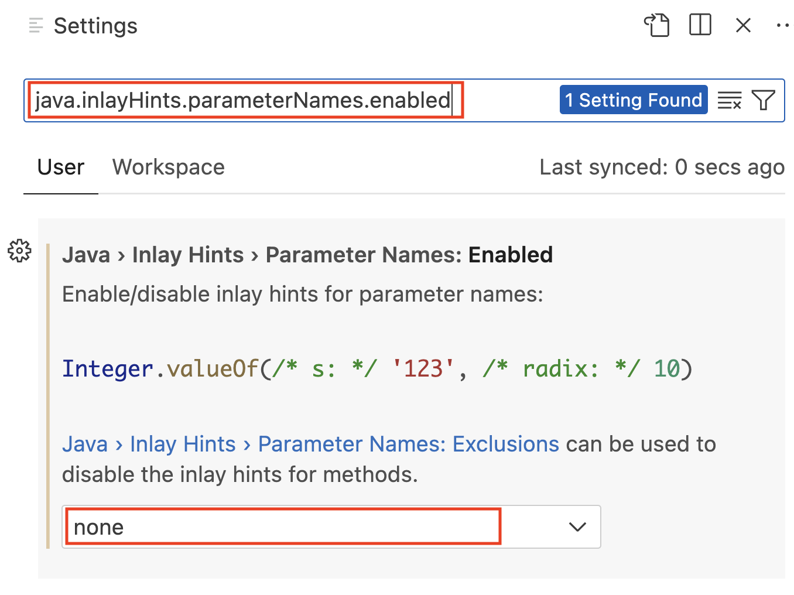

# VSCode: Inlay hints

Fonte: <https://stackoverflow.com/questions/71865654/why-is-vs-code-showing-this-these-labels-or-parameter-names-for-system-out-print>

Caso deseja remover estes comentários marcados em vermelho  
  

Acesse as configurações do VSCode em:

  

E digite

    java.inlayHints.parameterNames.enabled

Em ... escolha a opção "none".  
